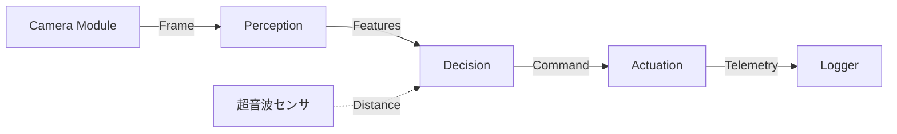

<<<<<<< HEAD
# Automational-Minidcar Project

自律走行ミニカーバトルに向けた、モジュール化設計に基づく制御ソフトウェア。

## 1. プロジェクトの思想

「ハードウェアがなくてもソフトウェアを開発できる」状態を目指します。
各モジュール（知覚・判断・駆動）をI/O（型）で切り離すことで、並行開発を可能にします。

## 2. ソフトウェアアーキテクチャ



### モジュール構成

- **Camera**: 画像取得・正規化（RGB/リサイズ）
- **Perception**: 画像から「左右のズレ（lateral_bias）」を抽出
- **Decision**: ズレと距離から「ステアリング・スロットル」を決定
- **Actuation**: 抽象的な数値を物理的なPWM信号（実機制御）へ変換

## 3. インターフェース定義 (I/O)

各担当者は以下の「バトン」の形を守って実装してください。

### A. Frame (Camera → Perception)

```python
@dataclass(frozen=True)
class Frame:
    frame_id: int
    t_capture_sec: float
    image: ImageBuffer  # RGB画像データ（Protocolで抽象化）
```

### B. Features (Perception → Decision)

```python
@dataclass(frozen=True)
class Features:
    frame_id: int
    t_capture_sec: float
    lateral_bias: float  # [-1.0 (左寄り) 〜 +1.0 (右寄り)] ※0.0が中央
    quality: float       # [0.0 〜 1.0] (信頼度)
    status: PerceptionStatus  # OK / INSUFFICIENT_SIGNAL / INVALID_INPUT
```

### C. Command (Decision → Actuation)

```python
@dataclass(frozen=True)
class Command:
    frame_id: int
    t_capture_sec: float
    steer: float      # [-1.0 (右) 〜 +1.0 (左)]
    throttle: float   # [0.0 (停止) 〜 1.0 (最大)]
    mode: DriveMode   # RUN / SLOW / STOP
```

### D. Telemetry (Actuationからの出力)

```python
@dataclass(frozen=True)
class Telemetry:
    frame_id: int
    t_capture_sec: float
    status: ActuationStatus  # OK / STOPPED / DRIVER_ERROR
    applied_steer: Optional[float]
    applied_throttle: Optional[float]
    steer_pwm_us: Optional[int]
    throttle_pwm_us: Optional[int]
```

## 4. 実機仕様 (TOYOTAスライド準拠)

12/27までに「制御用ドライバ」を以下の物理仕様に適合させます。

| 項目 | 接続・制御方法 | 備考 (スライドPAGE 46-47参照) |
|------|----------------|-------------------------------|
| 駆動モータ | PWM (GPIO No.13) | 標準値: 380付近 |
| 操舵サーボ | PWM (GPIO No.14) | 標準値: 400付近 |
| 超音波センサ | TRIG / ECHO | 3.3V降圧回路を必須とする |
| 緊急停止 | ソフトウェア割り込み | 全PWM出力を即座にニュートラルへ |

## 5. 開発ロードマップ

### P1: 基盤確定 (〜12/27)
- **ゴール**: 制御用ドライバを実機に差し替え、前後左右が100%動く状態にする。
- **TODO**: `Actuation.apply()` の中で実際のPWM制御を実装。

### P2: 認識実装 (1/12 〜 1/18)
- **ゴール**: 撮影済み動画（Mock Frame）を使って、家で判断ロジックを完成させる。
- **TODO**: OpenCVを用いたライン検出およびP制御の実装。

### P3: 実走完走 (1/19 〜 1/24)
- **ゴール**: TIBコースにて「3周連続完走（速度不問）」を達成。
- **TODO**: 現場の照明に合わせた閾値調整。

## 6. 実行方法 (Orchestrator)

### 基本的な使い方

```python
from auto_car_if.orchestrator import Orchestrator

# 各モジュールを初期化
camera = CameraModule()      # 実機またはモック
perception = Perception()    # 認識処理
decision = Decision()        # 判断処理
actuation = Actuation()      # 制御処理（実機/モック）

# Orchestratorを初期化して実行
orchestrator = Orchestrator(camera, perception, decision, actuation)
orchestrator.run_loop()
```

### テスト実行

#### Makefileを使用（推奨）

```bash
make test        # テストを実行
make run-mock    # モック環境で実行
make run         # 実機環境で実行（Raspberry Pi用）
make help        # すべてのコマンドを表示
```

#### 直接実行

```bash
python -m tests.test_orchestrator
```

モックモジュールを使用したテストが実行され、以下の流れが確認できます：
1. カメラからフレーム取得
2. 認識処理（lateral_bias抽出）
3. 判断処理（ステアリング/スロットル決定）
4. 制御適用（PWM信号生成）

## 7. プロジェクト構成

```
Automational-Minidcar/
├── Makefile                      # タスク自動化（makeコマンド用）
├── README.md                     # このファイル
├── regulation.md                 # 大会レギュレーション
├── auto_car_if/                  # メインパッケージ
│   ├── main.py                   # Orchestrator（メインループ）
│   ├── domain/                   # ドメインモデル（型定義）
│   │   ├── __init__.py
│   │   ├── frame.py              # Frame, ImageBuffer, ColorSpace, PixelFormat
│   │   ├── features.py           # Features, PerceptionStatus
│   │   ├── command.py            # Command, DriveMode
│   │   ├── vehicle_state.py      # VehicleState
│   │   └── actuation.py          # ActuationCalibration, Telemetry, ActuationStatus
│   ├── interfaces/               # インターフェース定義
│   │   └── protocols.py          # モジュール間のプロトコル定義
│   ├── camera/                   # 画像取得・正規化モジュール
│   │   ├── __init__.py
│   │   ├── pi.py                 # PiCameraCV実装（OpenCV）
│   │   └── mock.py               # モック実装
│   ├── perception/               # 特徴量抽出モジュール
│   │   ├── __init__.py
│   │   └── line.py               # LinePerception実装（ライン検出）
│   ├── decision/                 # 判断・制御ロジックモジュール
│   │   ├── __init__.py
│   │   └── simple.py             # SimpleDecision実装（P制御）
│   └── actuation/                # PWM信号生成・実機制御モジュール
│       ├── __init__.py
│       ├── pwm.py                # PWMActuation実装（pigpio）
│       └── mock.py                # モック実装
├── docs/                         # ドキュメント
│   └── module_design.md          # モジュール設計詳細
├── setup/                        # Docker開発環境
│   ├── Dockerfile
│   ├── docker-compose.yml
│   ├── requirements.txt
│   ├── .dockerignore
│   └── README.md                 # Docker環境セットアップガイド
├── tests/                        # テストスイート
│   ├── __init__.py
│   └── test_orchestrator.py      # Orchestratorテスト（モック環境）
├── examples/                     # 実装例とサンプルコード
│   ├── __init__.py
│   └── run_real.py               # 実機実行スクリプト（Pi Zero 2 W + pigpio）
```

### 実行方法

#### Makefileを使用（推奨）

```bash
# ヘルプを表示
make help

# テスト実行（モック環境）
make test

# モック環境で実行
make run-mock

# 実機環境で実行（Raspberry Pi用）
make run

# クリーンアップ
make clean

# Docker環境の操作
make docker-build    # Dockerイメージをビルド
make docker-up       # Dockerコンテナを起動
make docker-shell    # Dockerコンテナのシェルに接続
```

#### 直接実行

##### 1. 開発環境でのテスト実行（モック）
```bash
python -m tests.test_orchestrator
```
モック環境でOrchestrator全体の流れを確認できます。OpenCV/pigpioは不要です。

##### 2. 実機環境での実行
```bash
# 前提条件：
# - Raspberry Pi Zero 2 W上で実行
# - pigpiod起動済み（sudo pigpiod）
# - 依存ライブラリがインストール済み（setup/requirements.txt参照）

python examples/run_real.py
```
実機用のカメラ・認識・判断・制御が統合されて動作します。


© 2024-2025 Automational-Minidcar Team. Developed for 42 Tokyo Minidcar Battle.
