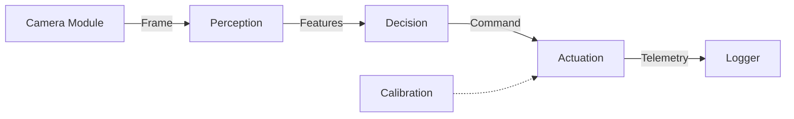
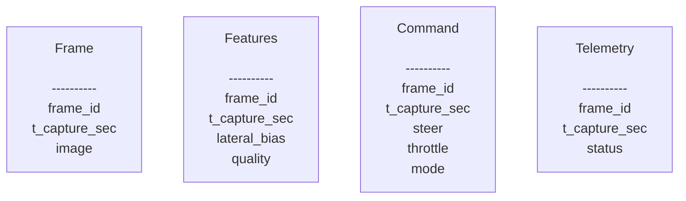

## module design

以下にソフトウェアアーキテクチャとインターフェース定義を記載する。

目的は、ハードウェアやアルゴリズムの詳細に依存せず、以下の明確に分離されたモジュールとして設計し、段階的・安全に実装を進められる土台を作ることです。

1. カメラ入力
2. 知覚（Perception）
3. 判断（Decision）
4. 駆動（Actuation）

---

## 設計方針

- 段階的実装（イテレーション）  
  第1イテレーションでは設計をシンプルに保つ事とし、以下の事項は次段階で検討する。
  - 並列化・非同期化
  - Decisionの入力として現在の状態(走行速度、ステアリングの向き)を与える。
- ハード依存の隔離
  PWM/I2C/サーボ/ESC などの物理制御は Actuation に閉じ込め、  
  上位層は抽象的な数値（-1〜1, 0〜1）のみを扱う。

---

## モジュール構成



- Camera Module  
  カメラデバイスから画像を取得し、正規化された `Frame` を生成する。
- Perception  
  画像から進行方向に関する観測量（例：`lateral_bias`）と信頼度を算出する。
- Decision  
  観測結果に基づき、操舵・速度・モードを含む `Command` を決定する。
- Actuation  
  抽象的な `Command` を、実機用の物理信号（PWM等）に変換して適用する。

これらは オーケストレーターによって順序通りに接続される。

---

## データ定義

各モジュール間でやりとりするデータ構造の定義は以下のとおり。



## Frame（Camera → Perception）

カメラから取得した 1フレーム分の観測データを表す。

- frame_id  
  フレームを一意に識別するための連番ID。  
  後続のすべてのデータ（Features / Command / Telemetry）と対応付けるためのキー。

- t_capture_sec  
  この画像が撮影された時刻。  
  処理時刻ではなく、観測時刻を表す。

- image  
  正規化済みの画像データ本体。  
  色空間や解像度の統一は Camera Module の責務とする。

---

## Features（Perception → Decision）

画像から抽出された、判断に必要な観測結果を表す。

- frame_id  
  元になった Frame のID。  
  Decision やログで Frame と対応付けるために使用する。

- t_capture_sec  
  元の Frame の撮影時刻。  
  判断がどれくらい古い情報に基づいているかを知るために引き継ぐ。

- lateral_bias  
  進行方向に対する左右の偏りを表す値。  
  正の値は左へ寄りたい、負の値は右へ寄りたいことを意味する。  
  判断ではなく、あくまで観測結果。

- quality  
  この観測結果がどれくらい信頼できるかを示す指標。  
  見えていない・不安定な場合は低くなる。  
  Decision 側で減速や停止判断に使われる。

- signals  
  補助的な数値情報。  
  Perception 内部の詳細な計算結果を必要に応じて外に出すための拡張枠。

- debug  
  デバッグ・可視化専用の情報。  
  人間が確認するためのもので、Decision のロジックには使用しない。

- status  
  Perception 自身による結果の自己評価。  
  観測が十分かどうかを状態として表す。

---

## Command（Decision → Actuation）

判断結果としての動作指令を表す。

- frame_id  
  この指令が基づいた Features / Frame のID。  
  後から判断の根拠を追跡するために使用する。

- t_capture_sec  
  元になった Frame の撮影時刻。  
  実行時の遅延を把握するために引き継ぐ。

- steer  
  操舵方向と量を表す指令。  
  左右どちらにどれくらい切りたいかを示す抽象的な値。

- throttle  
  前進量を表す指令。  
  どれくらいの強さで進みたいかを示す。

- mode  
  動作モード。  
  通常走行・減速・停止などの状態を明示する。

- reason  
  なぜこの指令になったかの説明。  
  ログやデバッグ用途で使用する。

---

## Telemetry（Actuation → Logger）

実際にどのように指令が適用されたかを表す結果データ。

- frame_id  
  対応する Command / Frame のID。

- t_capture_sec  
  元になった Frame の撮影時刻。

- status  
  指令が正常に適用されたかどうかを示す状態。

- applied_steer  
  実際に適用された操舵量。  
  安全制限などにより Command と異なる場合がある。

- applied_throttle  
  実際に適用された前進量。

---

## ActuationCalibration（設定データ）

抽象的な指令を実機の物理信号に変換するためのルール。

- ステアリング関連の設定  
  中央位置や左右の最大可動範囲を定義する。

- スロットル関連の設定  
  停止・最大出力などの基準を定義する。

- 安全制限  
  操舵量や速度の上限を制限するためのパラメータ。

Calibration は処理中に生成されるものではなく、  
事前に用意され、Actuation が参照する設定情報である。

---

## コードに書き出したもの

```py
# ============================
# auto_car_if/
#   types_common.py
#   types_frame.py
#   types_features.py
#   types_command.py
#   types_vehicle_state.py
#   types_actuation.py
#   protocols.py
#   orchestrator_skeleton.py
# ============================

# --------------------------------
# types_common.py
# --------------------------------
from __future__ import annotations

from dataclasses import dataclass
from enum import Enum
from typing import Any, Mapping, Optional


# --------------------------------
# types_frame.py
# --------------------------------
from __future__ import annotations

from dataclasses import dataclass
from enum import Enum
from typing import Optional, Protocol, runtime_checkable


class ColorSpace(str, Enum):
    RGB = "RGB"


class PixelFormat(str, Enum):
    UINT8 = "uint8"


@runtime_checkable
class ImageBuffer(Protocol):
    """
    Camera module -> Perception の '画像' 最小契約。
    実体は numpy / bytes / custom など何でもよいが、メタ情報と生データ参照ができること。
    """
    @property
    def width(self) -> int: ...
    @property
    def height(self) -> int: ...
    @property
    def channels(self) -> int: ...
    @property
    def pixel_format(self) -> PixelFormat: ...
    @property
    def color_space(self) -> ColorSpace: ...
    def as_bytes(self) -> bytes: ...


@dataclass(frozen=True)
class Frame:
    """
    Camera module -> Perception 入力（1フレーム）。
    - color_space は RGB 固定（前段で正規化する方針）
    """
    frame_id: int
    t_capture_sec: float
    image: ImageBuffer

    # 将来用（第1イテレーションでは未使用でOK）
    camera_id: Optional[str] = None
    exposure_us: Optional[int] = None
    gain: Optional[float] = None


# --------------------------------
# types_features.py
# --------------------------------
from __future__ import annotations

from dataclasses import dataclass
from enum import Enum
from typing import Any, Mapping, Optional


class PerceptionStatus(str, Enum):
    OK = "OK"
    INSUFFICIENT_SIGNAL = "INSUFFICIENT_SIGNAL"
    INVALID_INPUT = "INVALID_INPUT"


@dataclass(frozen=True)
class Features:
    """
    Perception -> Decision 出力。

    Contract:
    - lateral_bias: [-1.0, +1.0]
        + : 左へ寄りたい（右側の圧迫が強い等）
        - : 右へ寄りたい（左側の圧迫が強い等）
    - quality: [0.0, 1.0]
        推定の信頼度（0は信用しない、1は高信頼）
    """
    frame_id: int
    t_capture_sec: float

    lateral_bias: float   # [-1, +1]
    quality: float        # [0, 1]

    # 任意：追加の数値観測（拡張用）
    signals: Optional[Mapping[str, float]] = None

    # 任意：デバッグ用（Decisionは参照しない方針）
    debug: Optional[Mapping[str, Any]] = None

    status: PerceptionStatus = PerceptionStatus.OK


# --------------------------------
# types_command.py
# --------------------------------
from __future__ import annotations

from dataclasses import dataclass
from enum import Enum
from typing import Optional


class DriveMode(str, Enum):
    RUN = "RUN"
    SLOW = "SLOW"
    STOP = "STOP"


@dataclass(frozen=True)
class Command:
    """
    Decision -> Actuation 出力。

    Contract:
    - steer: [-1.0, +1.0]
        + : 左へ切る
        - : 右へ切る
    - throttle: [0.0, +1.0]（前進のみ）
    - STOP の場合、throttle == 0.0 を保証する（安全契約）
    """
    frame_id: int
    t_capture_sec: float

    steer: float          # [-1, +1]
    throttle: float       # [0, +1]
    mode: DriveMode

    reason: Optional[str] = None


# --------------------------------
# types_vehicle_state.py  (雛形：第1イテレーションでは未使用でOK)
# --------------------------------
from __future__ import annotations

from dataclasses import dataclass
from typing import Optional


@dataclass(frozen=True)
class VehicleState:
    """
    将来拡張用の状態（雛形）。
    例: 変化率制限、スムージング、PID、見失い継続の判断などに使える。
    """
    t_state_sec: float

    prev_steer: Optional[float] = None      # [-1, +1]
    prev_throttle: Optional[float] = None   # [0, +1]
    dt_sec: Optional[float] = None

    lost_count: Optional[int] = None


# --------------------------------
# types_actuation.py
# --------------------------------
from __future__ import annotations

from dataclasses import dataclass
from enum import Enum
from typing import Optional


@dataclass(frozen=True)
class ActuationCalibration:
    """
    Command(正規化値) -> 実機信号(PWM等)への写像ルール（定数/設定）。
    ※第1イテレーションでは値は仮でも、I/Fとして分離しておく。
    """
    # steering servo
    steer_center_us: int
    steer_left_us: int     # steer=+1.0
    steer_right_us: int    # steer=-1.0

    # throttle (ESC)
    throttle_stop_us: int
    throttle_max_us: int   # throttle=+1.0

    # optional limits (safety clamp)
    steer_limit: float = 1.0
    throttle_limit: float = 1.0


class ActuationStatus(str, Enum):
    OK = "OK"
    STOPPED = "STOPPED"
    DRIVER_ERROR = "DRIVER_ERROR"
    CALIBRATION_ERROR = "CALIBRATION_ERROR"


@dataclass(frozen=True)
class Telemetry:
    """
    Actuation の適用結果（ログ/デバッグ向け）。
    """
    frame_id: int
    t_capture_sec: float

    status: ActuationStatus
    applied_steer: Optional[float] = None
    applied_throttle: Optional[float] = None

    steer_pwm_us: Optional[int] = None
    throttle_pwm_us: Optional[int] = None

    message: Optional[str] = None


# --------------------------------
# protocols.py  (Cのprototype相当)
# --------------------------------
from __future__ import annotations

from typing import Iterator, Protocol

from types_frame import Frame
from types_features import Features
from types_command import Command
from types_actuation import ActuationCalibration, Telemetry


class CameraModule(Protocol):
    """
    Camera module external I/F:
    - 最新フレームを提供する責務（RGB固定などの正規化はここで行う方針）
    """
    def frames(self) -> Iterator[Frame]:
        ...


class Perception(Protocol):
    """Perception external I/F: Frame -> Features"""
    def process(self, frame: Frame) -> Features:
        ...


class Decision(Protocol):
    """Decision external I/F (第1イテレーション): Features -> Command"""
    def decide(self, features: Features) -> Command:
        ...


class Actuation(Protocol):
    """Actuation external I/F: Command -> Telemetry"""
    def configure(self, calib: ActuationCalibration) -> None:
        ...

    def apply(self, command: Command) -> Telemetry:
        ...

    def stop(self, reason: str) -> Telemetry:
        ...

    def close(self) -> None:
        ...


# --------------------------------
# orchestrator_skeleton.py  (run_once / run_loop の骨格：設計レベル)
# --------------------------------
from __future__ import annotations

from typing import Optional

from protocols import CameraModule, Perception, Decision, Actuation
from types_actuation import Telemetry
from types_command import Command, DriveMode


class Orchestrator:
    """
    全体をつなぐ役（レベル0単一ループ想定）。
    - 中身（アルゴリズム/ハード）を知らず、I/Fだけで接続する。
    """
    def __init__(self, camera: CameraModule, perception: Perception, decision: Decision, actuation: Actuation):
        self.camera = camera
        self.perception = perception
        self.decision = decision
        self.actuation = actuation

    def run_once(self, frame) -> Telemetry:
        """
        1フレーム分の処理（例外処理や安全停止ポリシーは必要に応じて追加）。
        """
        features = self.perception.process(frame)
        command = self.decision.decide(features)
        telemetry = self.actuation.apply(command)
        return telemetry

    def run_loop(self) -> None:
        """
        連続実行（第1イテレーションは単純に繰り返すだけ）。
        最新優先の高度化（古いフレーム破棄等）は次イテレーションで扱う。
        """
        for frame in self.camera.frames():
            _ = self.run_once(frame)

    def emergency_stop(self, reason: str = "emergency") -> Telemetry:
        """
        上位から明示停止できる入口（設計上の口）。
        """
        return self.actuation.stop(reason)

```
